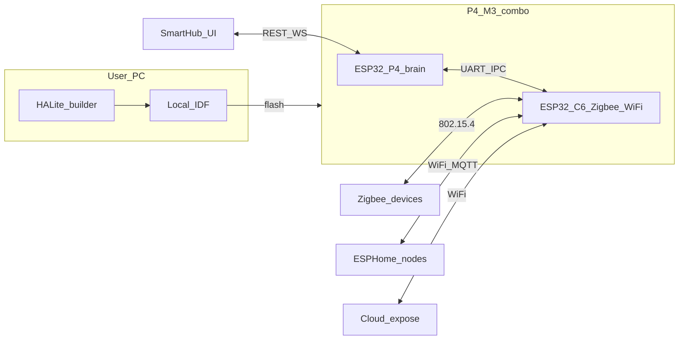

# HALite

Mini Home Assistant–style hub for **ESP32-P4 + ESP32-C6** (P4‑M3 combo).

This tree holds **design deliverables** for Part 1 (direct control + reporting). Firmware and builder code land here after ADRs and protocols are signed off.

## Architecture (Part 1)



**Win vs standalone zigbee-gateway:** C6 does **not** use Wi‑Fi to reach the brain — that is UART IPC. C6 Wi‑Fi is for ESPHome, SmartHub/LAN, and cloud expose only.

```text
halite/
  README.md
  docs/           # ADRs, entity model, extract map, builder, acceptance, security
  protocol/       # IPC spec, OpenAPI, include/halite_ipc.h
  tools/          # ipc-loopback harness
  firmware/       # (future) c6-radio/, p4-hub/
  builder/        # (future) ESPHome external component
  ui/             # (future) control surface
```

## Locked product decisions

| Topic | Choice |
|-------|--------|
| Zigbee stack location | **On C6** (coordinator-on-C6), not RCP on P4 |
| Wi‑Fi | **On C6** (with Zigbee) — ESPHome, SmartHub/LAN, cloud expose |
| P4↔C6 link | **UART IPC only** (no Wi‑Fi hop between chips) |
| ESPHome device ingest (Part 1) | **MQTT client on C6** → IPC to P4 (Native API later) |
| Creation UX | ESPHome **external component** on user’s PC (local compile) |
| Part 1 scope | Zigbee + ESPHome control/report only |
| Deferred | Automations, Tuya `0xEF00`, full cloud productization |

## Related code today

- [`../zigbee-gateway`](../zigbee-gateway) — working C6 Zigbee→MQTT→HA gateway (source for c6-radio extract)
- [`../solarstats`](../solarstats) — cloud UI patterns (devices, auth) for later inspiration only

## Read next

1. [docs/README.md](docs/README.md)
2. [docs/adr/](docs/adr/)
3. [protocol/ipc.md](protocol/ipc.md)
4. [docs/part1-acceptance.md](docs/part1-acceptance.md)
5. [tools/ipc-loopback/](tools/ipc-loopback/) — `python frame.py selftest`
