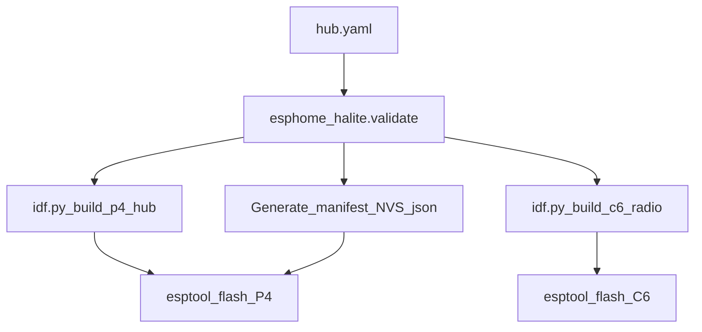

# HALite builder (ESPHome-shaped, PC-local)

See [ADR-0005](adr/0005-builder-external-component.md).

## Roles (do not conflate)

| Role | Tooling | Output |
|------|---------|--------|
| **Hub builder** | This module | Flash P4 + C6 HALite firmware + NVS/manifest |
| **Endpoint devices** | Stock ESPHome YAML | Normal ESPHome nodes on Wi‑Fi; **C6** ingests via MQTT → IPC to P4 |

The browser only edits config and shows logs. **Compile/flash runs on the PC** (`esphome` / IDF / `esptool`).

## Proposed layout

```text
halite/builder/
  README.md
  esphome_halite/          # Python package (external component)
    __init__.py
    hub.py                 # YAML schema + validate
    build_idf.py           # invoke idf.py for c6-radio + p4-hub
    flash.py
  example/
    hub.yaml
    endpoint_switch.yaml   # companion ESPHome device for Part 1 slice
```

## Example hub YAML (illustrative)

```yaml
halite_hub:
  name: home-halite
  board: p4_m3_combo          # builder profile → IDF targets + UART pins
  wifi:
    ssid: !secret wifi_ssid
    password: !secret wifi_password
    # Applied to C6 STA (Zigbee coexistence: pick channel wisely)
  mqtt:
    broker: 192.168.1.10
    username: !secret mqtt_user
    password: !secret mqtt_password
    # MQTT client runs on C6; P4 sees entities over UART IPC
  zigbee:
    channel: 15
  ipc:
    uart:
      baud: 921600
      # pins from board profile unless overridden
  cloud:
    # optional expose / tunnel endpoint consumed by C6 Wi‑Fi
    enabled: false
  api:
    token: !secret halite_token   # optional Part 1 bearer (P4 authority)
  esphome_entities:
    - entity_id: switch.bench_lamp
      name: Bench lamp
      node_name: bench-lamp
      mqtt_state_topic: bench-lamp/switch/bench_lamp/state
      mqtt_command_topic: bench-lamp/switch/bench_lamp/command
  # Zigbee entities appear at runtime via IPC after join;
  # optional seed list can pre-declare friendly names by IEEE later.
```

## Build flow



CLI without dashboard (required fallback):

```bash
# conceptual
python -m esphome_halite build example/hub.yaml
python -m esphome_halite flash example/hub.yaml --port-p4 COMx --port-c6 COMy
```

Dashboard integration: external component registers a “HALite Hub” device type or a custom dashboard page that shells the same build/flash entrypoints.

## Board profiles

`board: p4_m3_combo` resolves to:

- IDF target P4 + C6
- Default UART GPIO map for IPC
- Partition tables
- Whether P4 has native Wi‑Fi / needs module

Unknown boards fail validation with a clear error.

## Spike criteria (before full builder)

1. External component loads in ESPHome dashboard / CLI.
2. `build` invokes `idf.py build` for a **hello-world** on C6 (or P4) and surfaces logs in the UI.
3. Flash succeeds over USB.
4. Hub YAML validation rejects missing Wi‑Fi/MQTT when ESPHome entities are listed.

Full hub firmware build comes after IPC + extract (see plan milestones).

## Secrets

Reuse ESPHome `secrets.yaml`. Never embed Wi‑Fi/MQTT passwords in git examples.
