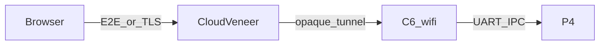

# Security and cloud (design hooks — Part 1+)

Document-only for now. No Part 1 implementation required beyond optional LAN bearer token.

## Goals

- Admin and high-privilege actions can use **passkeys / WebAuthn** with P4 as relying party (keys on hub).
- Delegated control via **capability tokens** (signed, scoped, expiring) — “NFT-style” in the product sense of unforgeable grants, not a blockchain.
- **Cloud veneer** never sees plaintext device data unless the user opts in; prefer end-to-end encryption with P4 as key authority.

## Part 1 (ship)

| Control | Behaviour |
|---------|------------|
| LAN open | Default for bring-up |
| Optional `api.token` | Bearer on REST; `?token=` on WS ([p4-api.openapi.yaml](../protocol/p4-api.openapi.yaml)) |
| Cloud | Config flag only; no production tunnel |

## Later

### Passkeys on P4

- Store credentials in flash/NVS; challenge/response for admin UI.
- High-privilege: permit join, remove device, change Wi‑Fi/MQTT secrets, flash OTA.

### Capability tokens

```text
token = sign_P4(scope, entity_ids|*, exp, nonce)
```

- UI/cloud holds opaque tokens; P4 verifies before command execution.
- Scopes examples: `read`, `switch.set`, `zigbee.permit_join`.

### Cloud shim



- C6 Wi‑Fi terminates the tunnel (ADR-0002).
- P4 authorizes; C6 does not become a second policy engine.
- Same control UI codebase: local base URL vs cloud base URL.

## Non-goals

- Replacing LAN MQTT broker encryption (use broker TLS when available).
- Shipping a public multi-tenant cloud in Part 1.
