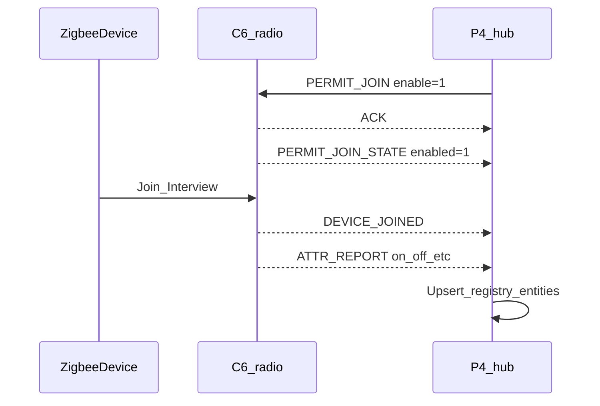
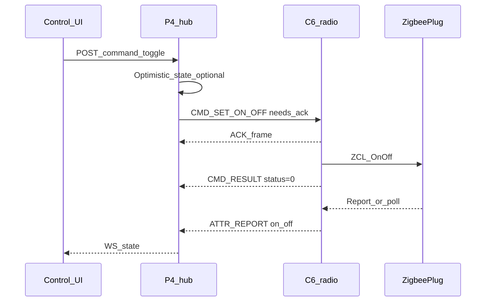
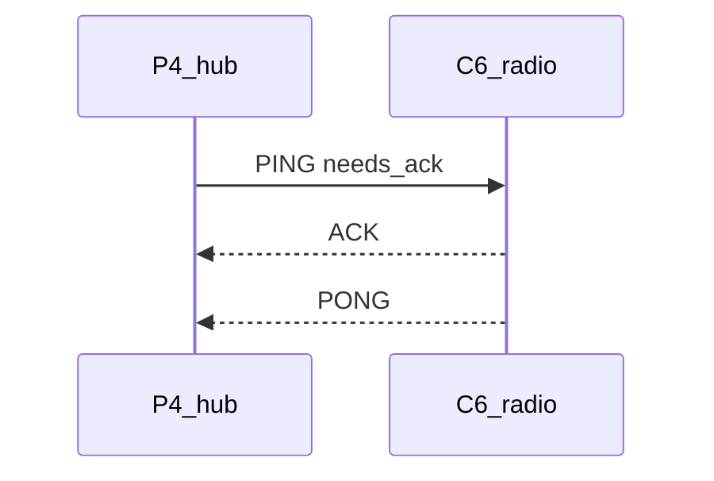
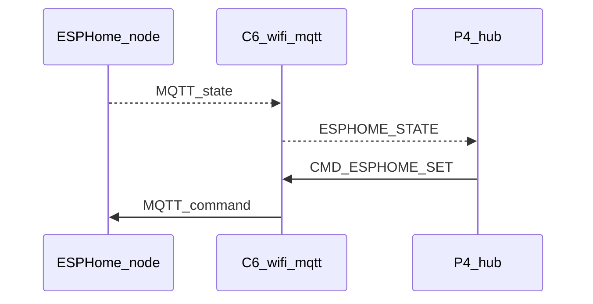

# HALite IPC v0 — P4 ↔ C6

Transport and encoding: [ADR-0003](../docs/adr/0003-ipc-uart-packed.md).

## Physical

| Parameter | Default |
|-----------|---------|
| Link | UART |
| Baud | 921600 |
| Format | 8N1 |
| Flow control | None (RTS/CTS optional later) |
| Max payload | 512 bytes |

## Frame layout (little-endian)

```text
Offset  Size  Field
0       2     magic = 0x484C ('HL')
2       1     version = 0x01
3       1     type    (message type)
4       1     flags   (bit0=needs_ack, bit1=is_ack, bit2=is_nack)
5       1     hdr_crc  (CRC8 of bytes 0..4) — optional early reject
6       2     seq     (uint16, wraps)
8       2     len     (payload length 0..512)
10      len   payload
10+len  2     crc16   (CCITT-FALSE over header without hdr_crc + payload; see impl note)
```

**Impl note:** Prefer CRC16-CCITT over `magic..len` with `hdr_crc` set to 0 for the checksum input, then payload. Exact algorithm fixed in shared `halite_crc.c` when firmware lands.

`seq` pairs requests with ACK/NACK. Unsolicited reports use incrementing seq; no ACK unless `needs_ack` is set.

## Message types

| Code | Name | Direction | Ack? | Purpose |
|------|------|-----------|------|---------|
| 0x01 | `PING` | either | yes | Liveness |
| 0x02 | `PONG` | either | no | Reply payload: uptime_ms |
| 0x10 | `PERMIT_JOIN` | P4→C6 | yes | payload: `u8 enable`, `u8 seconds` (0=default) |
| 0x11 | `PERMIT_JOIN_STATE` | C6→P4 | no | payload: `u8 enabled` |
| 0x20 | `DEVICE_JOINED` | C6→P4 | no | interview summary |
| 0x21 | `DEVICE_LEFT` | C6→P4 | no | ieee |
| 0x22 | `ATTR_REPORT` | C6→P4 | no | one attribute sample (Zigbee ieee key) |
| 0x28 | `ESPHOME_ENTITY` | C6→P4 | no | announce/update ESPHome entity binding |
| 0x29 | `ESPHOME_STATE` | C6→P4 | no | ESPHome state sample |
| 0x30 | `CMD_SET_ON_OFF` | P4→C6 | yes | Zigbee ieee + on/off |
| 0x31 | `CMD_REMOVE_DEVICE` | P4→C6 | yes | Zigbee ieee |
| 0x32 | `CMD_REDISCOVER` | P4→C6 | yes | empty |
| 0x33 | `CMD_ESPHOME_SET` | P4→C6 | yes | entity key + on/off (C6 publishes MQTT) |
| 0x3F | `CMD_RESULT` | C6→P4 | no | seq of command + status |
| 0x40 | `NET_STATUS` | C6→P4 | no | Wi‑Fi + MQTT + cloud link flags |
| 0x7F | `UNSUPPORTED` | either | no | echoed type |

### Payload sketches (packed)

**DEVICE_JOINED**

```c
typedef struct __attribute__((packed)) {
  uint64_t ieee;
  uint16_t short_addr;
  uint8_t  endpoint;
  uint8_t  reserved;
  uint32_t capabilities;
  char     manufacturer[32]; /* NUL-terminated if shorter */
  char     model[32];
} ipc_device_joined_t;
```

**ATTR_REPORT**

```c
typedef struct __attribute__((packed)) {
  uint64_t ieee;
  uint8_t  attr_id;   /* see attr ids below */
  uint8_t  ep;
  uint8_t  value_type; /* 0=bool, 1=i32, 2=float32 LE bits */
  uint8_t  reserved;
  uint32_t value_bits; /* bool in bit0; i32/float as raw bits */
} ipc_attr_report_t;
```

**Attribute ids (v0)**

| Id | Meaning | value_type |
|----|---------|------------|
| 1 | on_off | bool |
| 2 | temperature_c_x100 | i32 (centi-°C) |
| 3 | humidity_x100 | i32 |
| 4 | contact | bool |
| 5 | occupancy | bool |
| 6 | power_w_x10 | i32 (deci-W) |
| 7 | energy_wh | i32 |
| 8 | battery_pct | i32 |
| 9 | smoke | bool |
| 10 | battery_low | bool |

**CMD_SET_ON_OFF**

```c
typedef struct __attribute__((packed)) {
  uint64_t ieee;
  uint8_t  on; /* 0/1 */
  uint8_t  reserved[3];
} ipc_cmd_set_on_off_t;
```

**ESPHOME_ENTITY** (v0)

```c
typedef struct __attribute__((packed)) {
  char entity_id[48];   /* e.g. switch.bench_lamp */
  char node_name[32];
  uint8_t domain;       /* 1=switch, 2=binary_sensor, 3=sensor */
  uint8_t reserved[3];
  char state_topic[96];
  char command_topic[96];
} ipc_esphome_entity_t;
```

**ESPHOME_STATE**

```c
typedef struct __attribute__((packed)) {
  char entity_id[48];
  uint8_t value_type;   /* 0=bool/on_off, 1=i32 */
  uint8_t reserved[3];
  uint32_t value_bits;
} ipc_esphome_state_t;
```

**CMD_ESPHOME_SET**

```c
typedef struct __attribute__((packed)) {
  char entity_id[48];
  uint8_t on; /* 0/1 */
  uint8_t reserved[3];
} ipc_cmd_esphome_set_t;
```

**NET_STATUS**

```c
typedef struct __attribute__((packed)) {
  uint8_t wifi_up;
  uint8_t mqtt_up;
  uint8_t cloud_up;
  uint8_t reserved;
  int8_t  wifi_rssi;
  uint8_t reserved2[3];
} ipc_net_status_t;
```

**CMD_RESULT**

```c
typedef struct __attribute__((packed)) {
  uint16_t req_seq;
  int32_t  status; /* 0=ok, else esp_err-style / custom */
} ipc_cmd_result_t;
```

---

## Sequences

### Join



### Switch set



### Ping



---

### ESPHome state via C6 Wi‑Fi



Note: **P4 never associates to C6 over Wi‑Fi.** Off-board IP (ESPHome, SmartHub clients, cloud expose) uses C6’s STA; P4↔C6 remains UART.

---

## Loopback harness plan

Before hardware combo bring-up, validate framing on a PC (or single MCU):

1. **`halite/tools/ipc-loopback/`** (future): Python script that opens two ends of a virtual serial pair (Windows `com0com` / Linux `socat`) or one USB-UART with TX–RX looped.
2. **Golden vectors:** binary files under `protocol/testdata/` for each message type (encode/decode unit tests in C when firmware exists).
3. **Fake C6:** Python process that answers `PING`, accepts `PERMIT_JOIN`, emits a canned `DEVICE_JOINED` + `ATTR_REPORT` for a test IEEE.
4. **Fake P4:** Python that sends `CMD_SET_ON_OFF` and asserts `CMD_RESULT`.
5. Exit criteria: 1000 frames round-trip with zero CRC errors; command latency &lt; 50 ms on loopback.

Shared constants header (when implemented): `halite/protocol/include/halite_ipc.h` mirroring this document.
